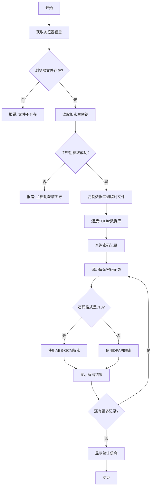

# 流程图与原理说明

本文档解释浏览器密码提取工具的工作原理和流程。

## 工作流程图

## 密码解密原理

现代浏览器采用两级加密策略来保护存储的密码：

1. **主密钥获取**
   - 浏览器在Local State文件中存储加密的主密钥
   - 主密钥使用Windows DPAPI (Data Protection API)加密
   - 使用CryptUnprotectData函数解密主密钥

2. **密码解密**
   - **v10格式** (Chrome/Edge最新格式)
     - 格式: `v10` + IV(12字节) + 加密数据 + 认证标签(16字节)
     - 使用AES-GCM算法和主密钥解密
   - **旧格式**
     - 直接使用DPAPI (CryptUnprotectData)解密

## 实现细节

1. **浏览器密码存储位置**
   - Chrome: `%LOCALAPPDATA%\Google\Chrome\User Data\Default\Login Data`
   - Edge: `%LOCALAPPDATA%\Microsoft\Edge\User Data\Default\Login Data`

2. **主密钥存储位置**
   - Chrome: `%LOCALAPPDATA%\Google\Chrome\User Data\Local State`
   - Edge: `%LOCALAPPDATA%\Microsoft\Edge\User Data\Local State`

3. **密码数据库**
   - SQLite格式
   - 包含URL、用户名和加密密码
   - 查询: `SELECT origin_url, username_value, password_value FROM logins`

## 安全注意事项

本工具仅用于教育目的。未经授权访问他人密码数据可能违反法律法规。使用本工具时请遵守相关法律和道德准则。
